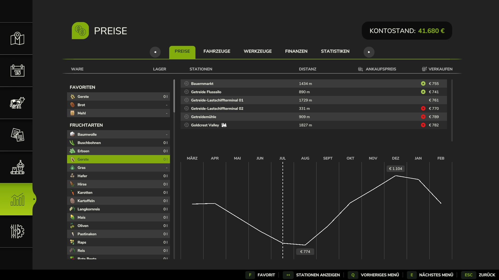

# Price Favorites (FS25)

Mark the goods you actually care about and pin them to the top of the in-game
**Prices** page in Farming Simulator 25.

---

> ## 🤖 AI-built mod — please read
>
> **This mod was primarily written by Claude (Anthropic's AI assistant).**
>
> I (**Yanni_X**) am a seasoned software developer, but I had **never done any
> Farming Simulator modding** before this. So I used Claude as the main coder:
> I drove the project — deciding what to build, steering the approach, testing
> every build in-game, and **reviewing all of the code** — while Claude did the
> bulk of the writing and the FS25 API archaeology.
>
> I'm telling you this openly so you can decide for yourself how much you trust
> an AI-assisted mod. The code is small, readable, and documented (see
> [`docs/DEVELOPMENT.md`](docs/DEVELOPMENT.md)). If you'd prefer a version that
> was written entirely by hand, you are explicitly **welcome to reimplement it**
> — see [Contributing](#contributing).

---

## What it does

The FS25 **Prices** page (in-game menu → *Statistics* → *Prices*) lists every
sellable good across two segments — directly harvestable crops, and everything
you can produce. If you only ever sell a handful of things (say, flour and
bread, or rapeseed and sunflower oil), finding them in that long list every time
is tedious.

**Price Favorites** adds a **"Favorites" segment pinned to the top** of that
list containing just the goods you marked as favorites. Mark a good with a key
press (or the on-screen button) and it jumps to the top — while still remaining
in its original segment, so nothing is hidden or moved away.

Favorites are stored **per player** and shared across **all your savegames**.

## Features

- ⭐ A **"Favorites" segment** at the top of the Prices list.
- ⌨️ **Toggle favorites** with a key (default **F**) or the **"Favorit"** button
  in the prices button-bar — acts on the highlighted good.
- 💾 **Saved per player**, shared across all savegames (stored in `modSettings`,
  not in the savegame).
- 🔁 Favorited goods **stay in their original segment** too (they're references,
  not copies).
- 🌍 English and German localization.

## Screenshot

The **Favoriten** segment (here: Gerste, Brot, Mehl) is pinned to the top of the
Prices list. Notice that *Gerste* still also appears below in its original
**Fruchtarten** segment — favorites are pinned, not moved. The **F · Favorit**
prompt in the bottom button-bar toggles the highlighted good.

## Installation

1. Download `FS25_PriceFavorites.zip` from the releases page.
2. Copy it into your mods folder:
   `Documents/My Games/FarmingSimulator2025/mods/`
3. Enable **Price Favorites** in the mod list when loading a savegame.

## Usage

1. Open the in-game menu (**Esc**) → **Statistics** → **Prices**.
2. Highlight a good in the list.
3. Press **F** (rebindable in the controls settings) or click the **"Favorit"**
   button to add/remove it from your favorites.
4. Favorites appear in the **Favoriten** segment at the top, instantly and
   across all your saves.

## Compatibility

- **Game:** Farming Simulator 25 (developed/tested on game version 1.20).
- **Multiplayer:** supported and tested on a dedicated server. Favorites are
  stored locally per player, so each player keeps their own list.

## Contributing

**Contributions are very welcome** — bug reports, fixes, translations, and
features. Open an issue or a pull request.

I genuinely **don't care about copyright** here (see [License](#license)). In
particular:

- If you want to build a **hand-crafted version without AI**, you have my
  **full permission to use this repository as a knowledge source** — the code,
  the docs, the API notes, all of it.
- **Credit is appreciated but not required.** A line in your README pointing
  back here is a nice gesture, nothing more.

If you're new to FS25 GUI internals, [`docs/DEVELOPMENT.md`](docs/DEVELOPMENT.md)
explains how the mod works and which game APIs it depends on (and which are most
likely to break on game updates).

## Credits

- **Yanni_X** — project lead, direction, testing, code review.
- **Claude (Anthropic)** — primary implementation and FS25 API research.

## License

Released into the **public domain** under [**CC0 1.0 Universal**](LICENSE) —
reuse, modify, and redistribute freely, for any purpose, no permission needed.
Credit is appreciated but **not required** (see [Contributing](#contributing)).

The `docs/screenshot.png` is an in-game screenshot and remains the property of
GIANTS Software; it is not covered by the CC0 dedication.
